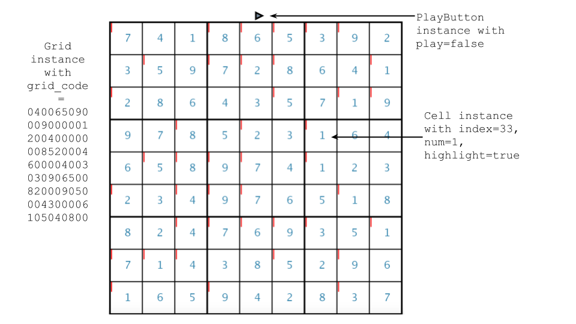
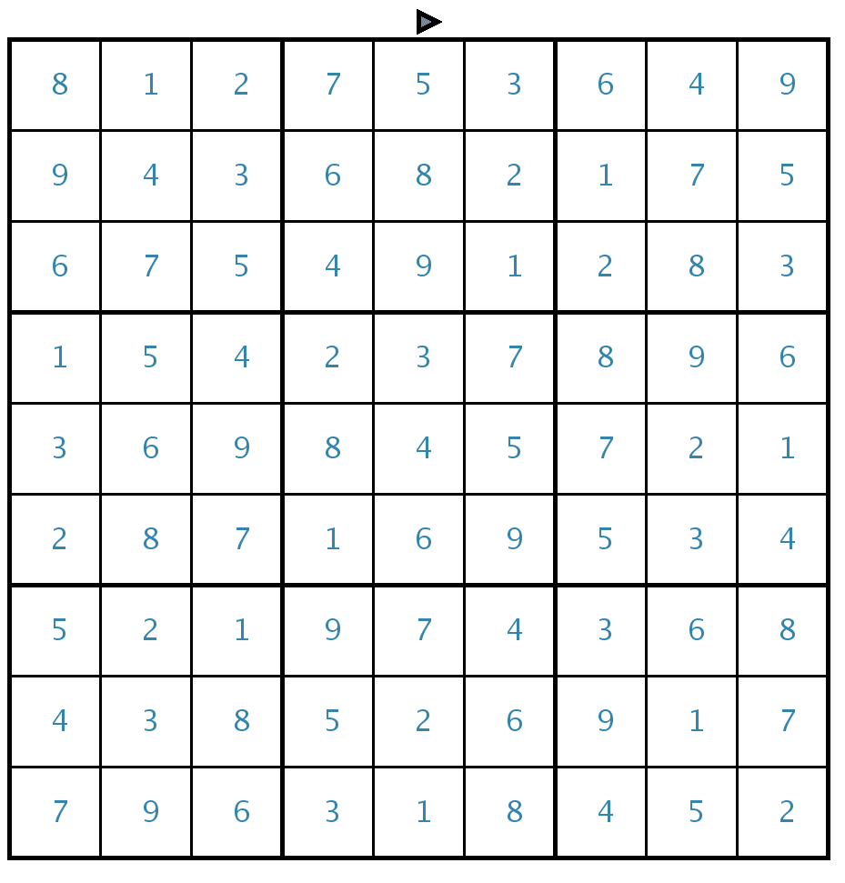

# Graphic Sudoku Solvers in Processing

Intro to Artificial Intelligence Project - Fall 2017

### Overview

In this project, I built three Sudoku solvers that use the following techniques: backtracking (`SolverBT`), simulated annealing (`SolverSA`), and a genetic algorithm (`SolverGA`). The underlying algorithm for each solver was designed in Java, and Processing was used to facilitate building the visualization attached to each solver.

Overview of the visualization:

The red lines indicate invalid cells, which are cells with a number that is not unique within its row, column, or subgrid.

### Solver Implementation

You can start the visualization in this project by running the file `sudoku_solver.pde`. Only one solver can run at the time, therefore the commands to run any other solver must be disabled.

* `SolverSA`: At each step, the simulated annealing algorithm chooses a random row, and switches two random cells within that row.

* `SolverGA`: At the mutation step, two random rows within the two parent grids are switched. At the crossover step, a random row is chosen within the given grid, and its values are changed to a new series of unique numbers from 1 to 9. The visualization of this solver displays the grid with the highest fitness within its population. The fitness of a grid is the number of valid cells it contains.

I made a variety of design choices when implementing `SolverSA` and `SolverGA` e.g. the process chosen to mutate grids within the genetic algorithm, or the mutation probability. The solvers from this project can easily be customized for different design choices for both `SolverSA` and `SolverGA`.

### Solving the "World's Hardest Grid"!

The backtracking algorithm from this project was used to solve the "World's Hardest Sudoku"! (https://www.telegraph.co.uk/news/science/science-news/9359579/Worlds-hardest-sudoku-can-you-crack-it.html)

### Contributing

You can submit pull requests to add new solvers, improve the visualization attached to each solver, or add any new feature that could improve the code base of this project. You can also submit an issue if you ran into a problem running any of the solvers.

### Resources

* Download Processing: https://processing.org/download/

* Lecture about genetic algorithms: https://www.youtube.com/watch?v=kHyNqSnzP8Y&t=919s
